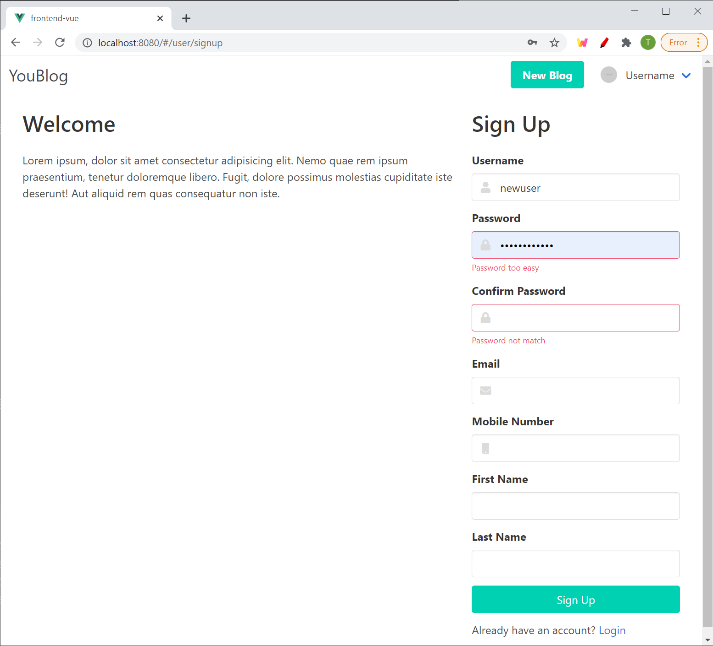
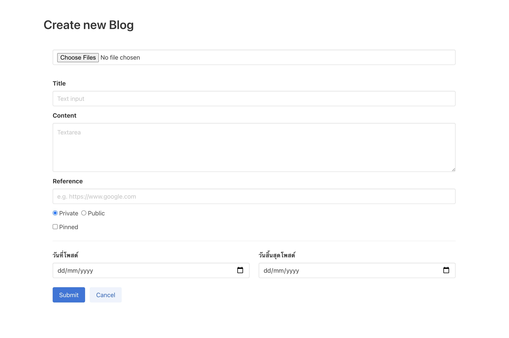

# WEEK13-TUTORIAL-EXERCISE

## Week 13 Exercise - Form Validation

ในสัปดาห์นี้เราจะมาเรียนเกี่ยวกับการทำ Validation หรือการ ตรวจสอบความถูกต้องของข้อมูล ซึ่งในทาง programming แล้วสิ่งนี้เป็นสิ่งที่สำคัญมาก เพราะว่าการเขียนโปรแกรมไม่ได้ทำอะไรมากไปกว่าการ คำนวณและย้ายที่ข้อมูล ถ้าข้อมูลที่เราเอามาใส่ในโปรแกรมของเราเป็นขยะ โปรแกรมของเราก็จะกลายเป็นโปรแกรมจัดการขยะนั่นเอง

# Setup

## Setup Database

import `db/wepro-2.sql`

## Clone / Download this project

```bash
git clone https://github.com/it-web-pro/WEEK13-TUTORIAL-EXERCISE.git
```

## Start Backend Server

```bash
cd backend
npm install
npm install joi bcrypt
npm run serve
```

เปิด browser แล้วไปที่ http://localhost:3000 เพื่อเช็คว่าใช้งานได้หรือไม่

## Start Frontend Server

```bash
cd frontend
npm install
npm install vuelidate
npm run serve
```

สำหรับคนที่ใช้ Node version 15 แล้วเจอ error เวลา `npm install` แบบนี้  
`Error: No version of chokidar is available. Tried chokidar@2 and chokidar@3.`  

ให้ใช้คำสั่งนี้ก่อน npm install

```bash
npm update --force
```

เปิด browser ไปที่ http://localhost:8080 เพื่อเช็คว่าใช้งานได้หรือไม่

# Tutorial

ตัวอย่างที่เราจะสร้างกันใน tutorial นี้คือหน้าเว็บสำหรับ signup ผู้ใช้ใหม่ โดยในหน้านี้จะมี `<form>` เพื่อเก็บข้อมูลดังนี้

- username ไม่ต่ำกว่า 5 ตัวอักษร และไม่ซ้ำกับผู้ใช้อื่นในระบบ ไม่เกิน 20 ตัวอักษร
- password ไม่ต่ำกว่า 8 ตัวอักษร เป็นภาษาอังกฤษพิมพ์เล็กผสมพิมพ์ใหญ่ผสมตัวเลข
- confirm password
- first_name ต้องกรอก ไม่เกิน 150 ตัวอักษร
- last_name ต้องกรอก ไม่เกิน 150 ตัวอักษร
- email ต้องกรอก และเป็นอีเมล์ที่ถูกต้อง
- mobile ต้องกรอก และเป็นเบอร์มือถือที่ถูกต้อง
- picture มีหรือไม่มีก็ได้ ถ้ามีเป็นภาพขนาดไม่เกิน 2 MB



ในตัวอย่างนี้เราจะเริ่มจากการทำฝั่ง backend ก่อน และเทส API ที่สร้างมาด้วย Postman เมื่อเราทดสอบจนมั่นใจแล้ว ก็จะไปสร้าง frontend และเรียกใช้ API ที่สร้างขึ้นมา

# Backend

## 1. สร้าง route ใหม่ที่ฝั่ง backend

สร้างไฟล์ `user.js` ใน `backend/router/`

```javascript
--------------------------------------------------------------------------------
File: backend/router/user.js
--------------------------------------------------------------------------------
+ | const express = require("express");
+ | const pool = require("../config");
+ |
+ | router = express.Router();
+ |
+ | router.post('/user/signup', async (req, res, next) => {
+ |     res.send('ok')
+ | })
+ |
+ | exports.router = router
```

ใน `backend/index.js` เพิ่มโค๊ดต่อไปนี้ เพื่อเป็น register route ใหม่ของเราเข้าไปใน express

```javascript
--------------------------------------------------------------------------------
File: backend/index.js
--------------------------------------------------------------------------------
  | // routers
  | const indexRouter = require('./routes/index')
  | const blogRouter = require('./routes/blog')
  | const commentRouter = require('./routes/comment')
  | const imageRouter = require('./routes/image')
+ | const userRouter = require('./routes/user')
  | 
  | app.use(indexRouter.router)
  | app.use(blogRouter.router)
  | app.use(commentRouter.router)
  | app.use(imageRouter.router)
+ | app.use(userRouter.router)
  | 
  | app.listen(3000, () => {
  |   console.log(`Example app listening at http://localhost:3000`)
  | })
```

จากนั้นทดสอบโดยใช้ Postman ยิง POST Request ไปที่ http://localhost:3000/user/signup/  
ต้องเห็น response เป็นคำว่า "ok"

## 2. เพิ่ม Backend Validation ด้วย Joi

> เพื่อความเข้าใจ แนะนำให้ทดสอบ API ด้วย postman ทุกครั้งหลักจากแก้ไขโค๊ดในแต่ละข้อย่อย

2.1 Validate `email` และ `mobile`

```javascript
--------------------------------------------------------------------------------
File: backend/router/user.js
--------------------------------------------------------------------------------
  | const express = require("express");
  | const pool = require("../config");
+ | const Joi = require('joi')
  |
  | router = express.Router();
  |
+ | const signupSchema = Joi.object({
? |   email: '', // ต้องกรอก และ เป็น email ที่ถูกต้อง,
+ |   mobile: Joi.string().required().pattern(/0[0-9]{9}/),
+ | }) 
  | 
  | router.post('/user/signup', async (req, res, next) => {
+ |   try {
+ |     await signupSchema.validateAsync(req.body,  { abortEarly: false })
+ |   } catch (err) {
+ |     return res.status(400).json(err)
+ |   }  
  |
  |   res.send('ok')
  | })
  |
  | exports.router = router
```

2.2 Validate `first_name` และ `last_name`

```javascript
--------------------------------------------------------------------------------
File: backend/router/user.js
--------------------------------------------------------------------------------
  | // ...
  | const signupSchema = Joi.object({
  |   email: Joi.string().required().email(),
  |   mobile: Joi.string().required().pattern(/0[0-9]{9}/),
? |   first_name: '',// ต้องกรอก ไม่เกิน 150 ตัวอักษร
? |   last_name: '',// ต้องกรอก ไม่เกิน 150 ตัวอักษร
  | }) 
  | 
  | router.post('/user/signup', async (req, res, next) => {
  |   try {
  |     await signupSchema.validateAsync(req.body,  { abortEarly: false })
  |   } catch (err) {
  |     return res.status(400).json(err)
  |   }
  |
  |   res.send('ok')
  | })
```

2.3 Validate `password` และ `confirm_password`  
เราสามารถสร้าง custom validator โดยใช้ [Joi.custom()](https://joi.dev/api/?v=17.4.0#anycustommethod-description)

```javascript
--------------------------------------------------------------------------------
File: backend/router/user.js
--------------------------------------------------------------------------------
  | // ...
  |
+ | const passwordValidator = (value, helpers) => {
+ |     if (value.length < 8) {
+ |         throw new Joi.ValidationError('Password must contain at least 8 characters')
+ |     }
+ |     if (!(value.match(/[a-z]/) && value.match(/[A-Z]/) && value.match(/[0-9]/))) {
+ |         throw new Joi.ValidationError('Password must be harder')
+ |     }
+ |     return value
+ | }
+ |
  | const signupSchema = Joi.object({
  |   email: Joi.string().required().email(),
  |   mobile: Joi.string().required().pattern(/0[0-9]{9}/),
  |   first_name: Joi.string().required().max(150),
  |   last_name: Joi.string().required().max(150),
+ |   password: Joi.string().required().custom(passwordValidator),
? |   confirm_password: '', // ต้องเหมือนกับ password
  | })
  | 
  | router.post('/user/signup', async (req, res, next) => {
  |   try {
  |     await signupSchema.validateAsync(req.body,  { abortEarly: false })
  |   } catch (err) {
  |     return res.status(400).json(err)
  |   }  
  |
  |   res.send('ok')
  | })
```

2.4 Validate `username` ไม่ซ้ำกับคนอื่น
เนื่องจากการที่จะ validate ให้ username ไม่ซ้ำกับคนอื่นจำเป็นต้อง query ข้อมูลจากฐานข้อมูลเพื่อดูว่าซ้ำมั้ยซึ่งเป็น async operation ดังนั้นต้องใช้ [Joi.external()](https://joi.dev/api/?v=17.4.0#anyexternalmethod-description)

```javascript
--------------------------------------------------------------------------------
File: backend/router/user.js
--------------------------------------------------------------------------------
  | // ...
  |
  | const passwordValidator = (value, helpers) => {
  |   if (value.length < 8) {
  |       throw new Joi.ValidationError('Password must contain at least 8 characters')
  |   }
  |   if (!(value.match(/[a-z]/) && value.match(/[A-Z]/) && value.match(/[0-9]/))) {
  |       throw new Joi.ValidationError('Password must be harder')
  |   }
  |   return value
  | }
+ |
+ | const usernameValidator = async (value, helpers) => {
+ |   const [rows, _] = await pool.query(
+ |     "SELECT username FROM users WHERE username = ?", 
+ |     [value]
+ |   )
+ |   if (rows.length > 0) {
+ |       const message = 'This user is already taken'
+ |       throw new Joi.ValidationError(message, { message })
+ |   }
+ |   return value
+ | }
  |
  | const signupSchema = Joi.object({
  |   email: Joi.string().required().email(),
  |   mobile: Joi.string().required().pattern(/0[0-9]{9}/),
  |   first_name: Joi.string().required().max(150),
  |   last_name: Joi.string().required().max(150),
  |   password: Joi.string().required().custom(passwordValidator),
  |   confirm_password: Joi.string().required().valid(Joi.ref('password')),
+ |   username: Joi.string().required().min(5).external(usernameValidator),
  | }) 
  | 
  | router.post('/user/signup', async (req, res, next) => {
  |   try {
  |     await signupSchema.validateAsync(req.body,  { abortEarly: false })
  |   } catch (err) {
  |     return res.status(400).json(err)
  |   }  
  |
  |   res.send('ok')
  | })
```

## 3. บันทึกข้อมูลผู้ใช้ลงในฐานข้อมูล

หลังจากที่เรา validate ข้อมูลเรียบร้อยแล้วขั้นตอนต่อไปคือบันทึกข้อมูลจาก `req.body` ลง database
แต่โดยทั่วไปแล้ว การบันทึกข้อมูล user ลงในฐานข้อมูลเราจะไม่เก็บ password เป็น plain text แต่จะทำการ hash ก่อนเพื่อความปลอดภัย  
Algorithm ที่เป็นที่นิยมในการ hash password คือ [bcrypt](https://www.npmjs.com/package/bcrypt)

```javascript
--------------------------------------------------------------------------------
File: backend/router/user.js
--------------------------------------------------------------------------------
  | // ...
+ | const bcrypt = require('bcrypt')
  |
  | const passwordValidator = (value, helpers) => {
  |   if (value.length < 8) {
  |       throw new Joi.ValidationError('Password must contain at least 8 characters')
  |   }
  |   if (!(value.match(/[a-z]/) && value.match(/[A-Z]/) && value.match(/[0-9]/))) {
  |       throw new Joi.ValidationError('Password must be harder')
  |   }
  |   return value
  | }
  |
  | const usernameValidator = async (value, helpers) => {
  |   const [rows, _] = await pool.query(
  |     "SELECT username FROM users WHERE username = ?", 
  |     [value]
  |   )
  |   if (rows.length > 0) {
  |       const message = 'This user is already taken'
  |       throw new Joi.ValidationError(message, { message })
  |   }
  |   return value
  | }
  |
  | const signupSchema = Joi.object({
  |   email: Joi.string().required().email(),
  |   mobile: Joi.string().required().pattern(/0[0-9]{9}/),
  |   first_name: Joi.string().required().max(150),
  |   last_name: Joi.string().required().max(150),
  |   password: Joi.string().required().custom(passwordValidator),
  |   confirm_password: Joi.string().required().valid(Joi.ref('password')),
  |   username: Joi.string().required().min(5).external(usernameValidator),
  | }) 
  | 
  | router.post('/user/signup', async (req, res, next) => {
  |   try {
  |     await signupSchema.validateAsync(req.body,  { abortEarly: false })
  |   } catch (err) {
  |     return res.status(400).json(err)
  |   }  
  |
- |   res.send('ok')
+ |   const conn = await pool.getConnection()
+ |   await conn.beginTransaction()
+ |
+ |   const username = req.body.username
+ |   const password = await bcrypt.hash(req.body.password, 5)
+ |   const first_name = req.body.first_name
+ |   const last_name = req.body.last_name
+ |   const email = req.body.email
+ |   const mobile = req.body.mobile
+ |
+ |   try {
+ |       await conn.query(
+ |           'INSERT INTO users(username, password, first_name, last_name, email, mobile) ' +
+ |           'VALUES (?, ?, ?, ?, ?, ?)',
? |           // เติมเอง
+ |       )
+ |       conn.commit()
+ |       res.status(201).send()
+ |   } catch (err) {
+ |       conn.rollback()
+ |       res.status(400).json(err.toString());
+ |   } finally {
+ |       conn.release()
+ |   }
  | })
```

# Frontend

## 0. Install Vuelidate

ทำการ install Vuelidate ในโฟลเดอร์ frontend ด้วยคำสั่ง
```bash
cd frontend # ทำให้มั่นใจว่าตัวเองอยู่ในโฟลเดอร์ frontend
npm install vuelidate
```

### What is Vuelidate?
`Vuelidate` เป็น library สำหรับทำการ validate form สำหรับ Vue.js โดยเฉพาะ -> [Website](https://vuelidate.js.org/#getting-started)

ก่อนอื่นเรามทำการเปิดการใช้งาน Plugin `Vuelidate` ด้วย Vue.use()
```javascript
--------------------------------------------------------------------------------
File: frontend/src/main.js
--------------------------------------------------------------------------------
  | import Vue from 'vue'
  | import App from './App.vue'
  | import router from './router'
  | // import { fab } from '@fortawesome/free-brands-svg-icons'
  | import { library } from '@fortawesome/fontawesome-svg-core'
  | import { fas } from '@fortawesome/free-solid-svg-icons'
  | import { FontAwesomeIcon } from '@fortawesome/vue-fontawesome'
+ | import Vuelidate from 'vuelidate'
  | 
  | import 'bulma/css/bulma.css'
  | 
  | library.add(fas)
  | 
  | Vue.component('icon', FontAwesomeIcon)
  | 
+ | Vue.use(Vuelidate)
  | 
  | Vue.config.productionTip = false
  | 
  | new Vue({
  |   router,
  |   render: h => h(App)
  | }).$mount('#app')
```

## 1. สร้างไฟล์ `Signup.vue` ใน `frontend/src/views/users/`

```javascript
--------------------------------------------------------------------------------
File: frontend/src/views/Signup.vue
--------------------------------------------------------------------------------
+ | <template>
+ |   <div>Signup Page</div>
+ | </template>
+ | 
+ | <script>
+ | export default {
+ |     
+ | }
+ | </script>
```

## 2. Register route ใหม่ใน `frontend/src/views/router/index.js`

```javascript
--------------------------------------------------------------------------------
File: frontend/src/views/router/index.js
--------------------------------------------------------------------------------
  | // ...
  | const routes = [
  |   {
  |     path: '/',
  |     name: 'home',
  |     component: () => import('../views/Home.vue')
  |   },
  |   {
  |     path: '/blogs/detail/:id',
  |     name: 'detail',
  |     component: () => import('../views/blogs/DetailBlog.vue')
  |   },
  |   {
  |     path: '/blogs/create',
  |     name: 'create-blog',
  |     component: () => import('../views/blogs/CreateBlog.vue')
  |   },
  |   {
  |     path: '/blogs/update/:id',
  |     name: 'update-blog',
  |     component: () => import('../views/blogs/UpdateBlog.vue')
c |   },
+ |   {
+ |     path: '/user/signup',
+ |     name: 'signup',
+ |     component: () => import('../views/Signup.vue')
+ |   }
  | ]
  | // ...
```

ลองทดสอบโดยไปที่ http://localhost:8080/#/user/signup

## 3. Copy html จากไฟล์ `template/signup.html` มาใส่ใน `<template>` ของ `frontend/src/views/Signup.vue`

```javascript
--------------------------------------------------------------------------------
File: frontend/src/views/Signup.vue
--------------------------------------------------------------------------------
  | <template>
>>|   <div>Copy html จากไฟล์ template/signup.html มาลงใน div นี้</div>
  | </template>
  | 
  | <script>
  | export default {
  |     
  | }
  | </script>
```

## 4. เพิ่ม data ใน `<script>`

```javascript
--------------------------------------------------------------------------------
File: frontend/src/views/Signup.vue
--------------------------------------------------------------------------------
  | // ...
  |
  | <script>
  | export default {
+ |   data () {
+ |     return {
+ |       username: '',
+ |       password: '',
+ |       confirm_password: '',
+ |       email: '',
+ |       mobile: '',
+ |       first_name: '',
+ |       last_name: ''
+ |     }
+ |   }
  | }
  | </script>
```

## 5. ทำ frontend validation

ในขั้นตอนนี้เราจะมาลองเริ่มใช้งาน `Vuelidate` กันนะครับ แต่ก่อนอื่นเรามาลองดูว่า `Vuelidate` ทำอะไรได้บ้างคร่าว และลองเล่น online tutorial ได้ที่ [Online Tutorial](https://vuelidate.js.org/#sub-basic-form)

### 5.1 Validate `email`

เราจะมาลอง validate field `email` กันนะครับ โดย `Vuelidate` เขาก็มี built-in validators ให้สามารถใช้งานได้ไม่จำเป็นต้องเขียนเอง - [รายการ Built-in Validators ที่มีให้เลือกใช้งาน](https://vuelidate.js.org/#sub-builtin-validators)

โดยในตัวอย่างนี้เราจะใช้งาน `email` และ `required` validators กันนะครับ

```javascript
--------------------------------------------------------------------------------
File: frontend/src/views/Signup.vue
--------------------------------------------------------------------------------
  | 
  | <template>
  |   ...
  |   <div class="field">
  |     <label class="label">Email</label>
  |     <div class="control has-icons-left has-icons-right">
c |       <input v-model="$v.email.$model" :class="{'is-danger': $v.email.$error}" class="input" type="text"/>
  |       <span class="icon is-small is-left">
  |         <i class="fas fa-envelope"></i>
  |       </span>
  |     </div>
- |     <p class="help is-danger">error</p>
+ |     <template v-if="$v.email.$error">
+ |       <p class="help is-danger" v-if="!$v.email.required">This field is required</p>
+ |       <p class="help is-danger" v-if="!$v.email.email">Invalid Email</p>
+ |     </template>
  |   </div>
  |   ...
  | </template>
  |
  | <script>
+ | import { required, email } from 'vuelidate/lib/validators'
  |
  | export default {
  |   data () {
  |     return {
  |       username: '',
  |       password: '',
  |       confirm_password: '',
  |       email: '',
  |       mobile: '',
  |       first_name: '',
  |       last_name: ''
  |     }
c |   },
+ |   validations: {
+ |     email: {
+ |       required, 
+ |       email
+ |     }
+ |   }
  | }
  | </script>
```

### 5.2 Validate `mobile`

เราจะมาลอง validate field `mobile` โดยการสร้าง custom validator กันนะครับ - [Custom Validators](https://vuelidate.js.org/#sub-simplest-example)

```javascript
--------------------------------------------------------------------------------
File: frontend/src/views/Signup.vue
--------------------------------------------------------------------------------
  | <template>
  |   ...
  |   <div class="field">
  |     <label class="label">Mobile Number</label>
  |     <div class="control has-icons-left has-icons-right">
c |       <input v-model="$v.mobile.$model" :class="{'is-danger': $v.mobile.$error}" class="input" type="text" />
  |       <span class="icon is-small is-left">
  |         <i class="fas fa-mobile"></i>
  |       </span>
  |     </div>
- |     <p class="help is-danger">error</p>
+ |     <template v-if="$v.mobile.$error">
+ |       <p class="help is-danger" v-if="!$v.mobile.required">This field is required</p>
+ |       <p class="help is-danger" v-if="!$v.mobile.mobile">Invalid Mobile Number</p>
+ |     </template>
  |   </div>
  |   ...
  | </template>
  |
  | <script>
  | import { required, email } from 'vuelidate/lib/validators'
  |
+ | function mobile (value) {
+ |   return !!value.match(/0[0-9]{9}/)
+ | }
  |
  | export default {
  |   data () {
  |     return {
  |       username: '',
  |       password: '',
  |       confirm_password: '',
  |       email: '',
  |       mobile: '',
  |       first_name: '',
  |       last_name: ''
  |     }
  |   },
  |   validations: {
  |     email: {
  |       required: required, 
  |       email: email
c |     },
+ |     mobile: {
+ |       required: required,
+ |       mobile: mobile
+ |     }
  |   }
  | }
  | </script>
```

### 5.3 Validate `password` และ `confirm_password`

```javascript
--------------------------------------------------------------------------------
File: frontend/src/views/Signup.vue
--------------------------------------------------------------------------------
  | // ...
  | <script>
c | import { required, email, minLength, sameAs } from 'vuelidate/lib/validators'
  |
  | function mobile (value) {
  |   return !!value.match(/0[0-9]{9}/)
  | }
  |
+ | function complexPassword (value) {
+ |   if (!(value.match(/[a-z]/) && value.match(/[A-Z]/) && value.match(/[0-9]/))) {
+ |     return false
+ |   }
+ |   return true
+ | }
  |
  | export default {
  |   data () {
  |     return {
  |       username: '',
  |       password: '',
  |       confirm_password: '',
  |       email: '',
  |       mobile: '',
  |       first_name: '',
  |       last_name: ''
  |     }
  |   },
  |   validations: {
  |     email: {
  |       required: required, 
  |       email: email
  |     },
  |     mobile: {
  |       required: required,
  |       mobile: mobile
c |     },
+ |     password: {
+ |       required: required,
+ |       minLength: minLength(8),
+ |       complex: complexPassword,
+ |     },
+ |     confirm_password: {
+ |       sameAs: sameAs('password'),
+ |     }
  |   }
  | }
  | </script>
```

### 5.4 Validate `username`, `first_name` และ `last_name`

**Field ที่เหลือ ลองทำกันดูเองนะครับ**

- username ต้องกรอก ไม่ต่ำกว่า 5 ตัวอักษร ไม่เกิน 20 ตัวอักษร (ส่วนการเช็คว่าซ้ำกับคนอื่นหรือไม่ จะไปทำการ validation ที่ฝั่ง backend)
- first_name ต้องกรอก ไม่เกิน 150 ตัวอักษร
- last_name ต้องกรอก ไม่เกิน 150 ตัวอักษร

## 6. ส่ง POST Request เพื่อบันทึกลงฐานข้อมูล

```javascript
--------------------------------------------------------------------------------
File: frontend/src/views/Signup.vue
--------------------------------------------------------------------------------
  | <template>
  |   ...
c |   <button class="button is-primary is-fullwidth" @click="submit()">Sign Up</button>
  |   ...
  | </template>
  |
  | <script>
+ | import axios from 'axios'
  |
  | // ...
  | export default {
  |   data () {
  |     return {
  |       username: '',
  |       password: '',
  |       confirm_password: '',
  |       email: '',
  |       mobile: '',
  |       first_name: '',
  |       last_name: ''
  |     }
  |   },
+ |   methods: {
+ |     submit() {
+ |       // Validate all fields
+ |       this.$v.$touch();
+ |
+ |       // เช็คว่าในฟอร์มไม่มี error
+ |       if (!this.$v.$invalid) {
+ |         let data = {
+ |           username: this.username,
+ |           password: this.password,
+ |           confirm_password: this.confirm_password,
+ |           email: this.email,
+ |           mobile: this.mobile,
+ |           first_name: this.first_name,
+ |           last_name: this.last_name,
+ |         }
+ |
+ |         axios
+ |           .post("http://localhost:3000/user/signup", data)
+ |           .then((res) => {
+ |             alert("Sign up Success");
+ |           })
+ |           .catch((err) => {
+ |             alert(err.response.data.details.message)
+ |           })
+ |       }
+ |     },
+ |   },
  | }
  | </script>
```

# Exercise

สำหรับใครที่อยากลองใช้งาน `Joi` และ `Vuelidate` สามารถลองทำแบบฝึกหัดด้านล่างได้นะครับ



**ให้นักศึกษาเพิ่มการเพิ่ม Field ใหม่ ทั้งส่วน frontend, backend และ database สำหรับหน้า Create Blog ดังนี้**

- `start_date` วันที่โพสต์ (yyyy-mm-dd)
- `end_date` วันสิ้นสุดโพสต์ (yyyy-mm-dd)
- `reference` เพื่อเก็บ url ที่นำมาใช้ในบทความ

**ให้นักศึกษาเพิ่มการ Validate ทั้งส่วน frontend และ backend ในหน้า Create Blog ดังนี้**

1. Backend Validation
- `title` ต้องกรอก เป็นตัวอักษรเท่านั้น ห้ามมีตัวเลข และมีความยาวระหว่าง 10-25 ตัวอักษร
- `content` ต้องกรอก และมีความยาวขั้นต่ำ 50 ตัวอักษร
- `status` กำหนดให้รับค่าส่วน backend เป็น string `'status_private'` หรือ `'status_public'` เท่านั้น
- `reference` รับค่าเป็น url เท่านั้น

2. Frontend Validation
- `title` ต้องกรอก เป็นตัวอักษรเท่านั้น ห้ามมีตัวเลข และมีความยาวระหว่าง 10-25 ตัวอักษร
- `content` ต้องกรอก และมีความยาวขั้นต่ำ 50 ตัวอักษร
- `status` กำหนดให้รับค่าส่วน backend เป็น string `'status_private'` หรือ `'status_public'` เท่านั้น
- `reference` รับค่าเป็น url เท่านั้น

3. Backend Validation
- `start_date` และ `end_date`
  - ไม่จำเป็นต้องกรอก 
  - ถ้ามีการกรอก ต้องกรอกทั้ง `start_date` และ `end_date`
  - ถ้ามีการกรอก `start_date` ต้องเป็นวันที่ ที่มาก่อน `end_date`

4. Frontend Validation
- `start_date` และ `end_date`
  - ไม่จำเป็นต้องกรอก 
  - ถ้ามีการกรอก ต้องกรอกทั้ง `start_date` และ `end_date`
  - ถ้ามีการกรอก `start_date` ต้องเป็นวันที่ ที่มาก่อน `end_date`

5. Frontend + Backend - Upload Image Validation
- `image` เป็นภาพขนาดไม่เกิน 1 MB
  - คำใบ้ : frontend นักศึกษาสามารถหาขนาดภาพได้โดยใช้ `file.size`
  - คำใบ้ : backend ใช้ multer
  
**การให้คะแนนแบบฝึกหัด**
- Frontend Validation -> (0.5 คะแนน)
- Backend Validation -> (0.5 คะแนน)
- Upload Image Validation -> (0.5 คะแนน)
