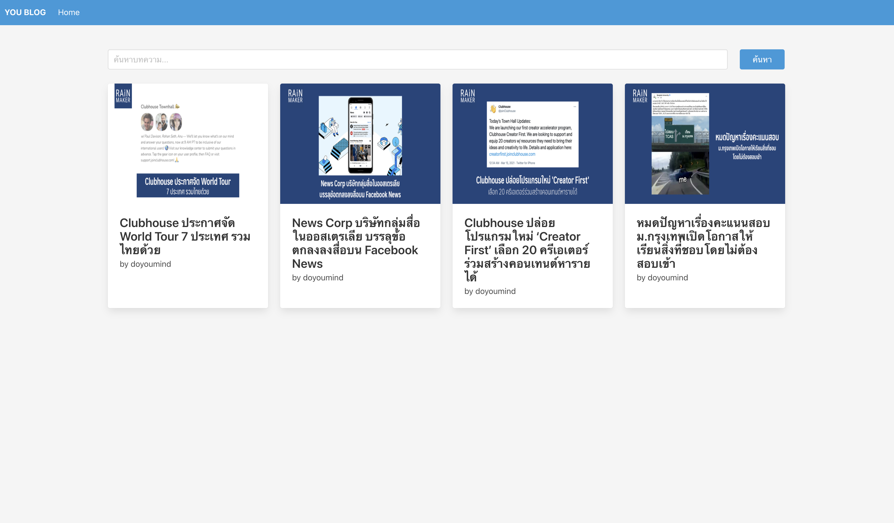
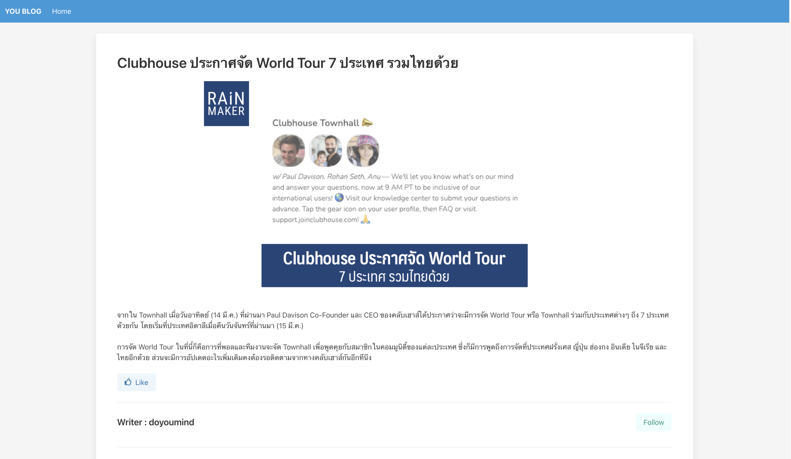
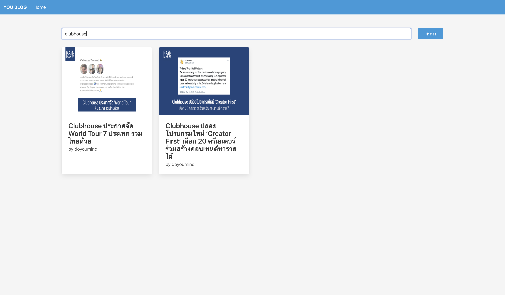

# Web Programming - Exercise 8

#### 1. New Project
ให้นักศึกษาสร้างโปรเจคชื่อ `youblog` โดยพิมพ์คำสั่งเหล่านี้ลงใน Terminal/Powershell ดังนี้
```
> cd Desktop
> mkdir youblog
> cd youblog
> npm init
```
ในขั้นตอนการ init ให้กำหนดดังนี้
- Package name : youblog
ส่วนอื่น ๆ ให้กด Enter ได้เลย

**หลังจากนั้น install express โดยพิมพ์:**
```
> npm install express
```
----

#### 2.	New Route
ทดลองสร้าง app และ route โดยให้นักศึกษาสร้างไฟล์ app.js และเขียนโค้ดดังนี้
```javascript

const express = require('express')

const app = express()

app.get('/', (req, res) => {
  res.send('Hello World')
})

app.listen(3000, () => {
  console.log('Start server at port 3000.')
})

```

Start server โดยพิมพ์คำสั่ง:
```
> node app.js
```

ทดลองดูผลลัพธ์ผ่านหน้าเว็บไซต์ โดยพิมพ์ localhost:3000 ในช่อง URL ของ Web Browser

----

#### 3.	Let's use Nodemon
เนื่องจากการแก้ไขไฟล์ทุกครั้ง เมื่อมีการแก้เราต้องทำการรัน node ใหม่ทุกครั้ง เราจะติดตั้ง nodemon เพื่อให้มีการ restart ไฟล์ใหม่ทุกครั้งที่มีการเปลี่ยนแปลง โดยให้ติดตั้งดังนี้

```
> npm install -g nodemon

หรือ

> npm install --save-dev nodemon
````

และทดลองใช้โดยเรียกคำสั่ง nodemon app

```
> nodemon app.js
> node_modules\.bin\nodemon app.js
```

----
#### 4. Create your first RESTFUL API
ให้นักศึกษาดาวน์โหลดไฟล์ article-db.json วางบน main folder project
จากนั้นแก้ไขไฟล์ app.js โดยเพิ่มข้อมูลดังนี้

```javascript
// ดึงข้อมูล json มาเก็บไว้ในตัวแปร

const article = require('./article-db')

// กำหนดให้ path blogapi แสดงข้อมูลบทความทั้งหมดในรูปแบบ json

app.get('/blogapi', (req, res) => {
  res.json(article)
})

// กำหนดให้ path blogapi/id แสดงข้อมูลบทความตาม id ที่กำหนด

app.get('/blogapi/:id', (req, res) => {
  res.json(article.find(article => article.id === req.params.id))
})
```

ทดลองดูได้ที่ http://localhost:3000/blogapi/ และ http://localhost:3000/blogapi/3

---
#### 5. EJS Template Engine
`npm install ejs`

สร้างโฟลเดอร์ใหม่ 3 โฟลเดอร์ ดังนี้
- public (สำหรับเก็บไฟล์ Asset ต่าง ๆ)
- routes (สำหรับเก็บ app ย่อย ๆ เพื่อจัดการหน้าเพจในหมวดต่าง ๆ)
- views (สำหรับเก็บไฟล์ template ejs ที่ใช้เรียกแสดงผล) 

เปิดไฟล์ app.js และใส่โค้ด setup ด้านล่าง

```javascript
const path = require('path')

// Setup ejs
app.set('view engine', 'ejs');
app.set('views', path.join(__dirname, 'views'));

// Setup static path
app.use(express.static(path.join(__dirname, 'public')))

// Config Router
const indexRouter = require('./routes/index')

app.use('/', indexRouter)
```

หลังจากนั้นทดลองสร้าง route ย่อย โดยสร้างไฟล์ชื่อ index.js ในโฟลเดอร์ routes และใส่โค้ดดังนี้

```javascript
const express = require('express')
const router = express.Router()

router.get('/', function(req, res, next) {
    var data = { title: 'Express' }
    res.render('index', data)
})

module.exports = router
```

----
#### 6. ทดลองสร้างไฟล์ ejs เพื่อเรียกใช้งานจริง โดยให้แสดง data ที่ส่งเข้าไปในไฟล์
ทำตามขั้นตอนดังนี้
1. สร้างไฟล์ index.ejs ในโฟลเดอร์ views 
2. นำโค้ดจากไฟล์ index-ejs.html ใส่ในไฟล์ index.ejs ในโปรเจคของเรา 
3. ลองเปิดหน้าเว็บไซต์ localhost:3000

----

#### 7.	ทดลอง Loop ชื่อบทความมาแสดงในรูปแบบ ul / li

แก้ไขไฟล์ routes/index.js ดังนี้

```javascript
const express = require('express')
const router = express.Router()
var article = require('../article-db')

router.get('/', function(req, res, next) {
    var data = { title: 'Express', article: article }
    res.render('index', data)

})
 
module.exports = router
```

และเพิ่มโค้ดด้านล่างนี้ในไฟล์ views/index.ejs

```html
    <ul>
      <% article.forEach(function(data, i, arr){ %>
      <li><%= data.title %></li>
      <% }); %>
    </ul>
```

----

#### 8.	จัด layout ของหน้าเวบด้วย include

ทำตามขั้นตอนดังนี้:
1. สร้างไฟล์ views/header.ejs ขึ้นมา
2. นำโค้ดในบรรทัดแรกจนถึง </ head> ไปไว้ในไฟล์ header.ejs 
3. ลบส่วนเดียวกันออกจากไฟล์ index.ejs และแทนที่ด้วย <%- include('header') -%>

----

#### 9.	ลองใช้งาน static file

ดาวน์โหลดไฟล์ที่กำหนดในใน /css ลงในโปรเจค 

ทดลองเรียกใช้ css ให้เปิดไฟล์ header.ejs และเพิ่มโค้ดเรียก 
```
<link rel='stylesheet' href='/css/bulma.css' />
```

----

#### [โจทย์] 10. ให้นักศึกษาสร้างหน้าเว็บ YouBlog โดยมี 2 หน้าเพจหลักดังนี้

##### 10.1. หน้าแสดงรายการบทความทั้งหมด (ภาพที่ 1)
โดยมีข้อกำหนดดังนี้
- แสดงผลที่ path: http://localhost:3000/
- ปรับแก้ไขไฟล์ views/index.ejs โดยนำไฟล์ใน folder html/ex10-index.html (บน Github) มาปรับใช้
- 1 แถวแสดง 4 บทความ
- แต่ละ Card บทความแสดงรูปภาพ ชื่อบทความ และ ชื่อผู้เขียน

**ภาพที่ 1**


##### 10.2. หน้าแสดงรายละเอียดของบทความ (ภาพที่ 2)
โดยมีข้อกำหนดดังนี้
- แสดงผลที่ path: http://localhost:3000/blog/:id/
- สร้างไฟล์ views/detail.ejs โดยนำไฟล์ใน Github folder html/ex10-content.html (บน Github) มาปรับใช้
- แสดงข้อมูลขอองบทความดังในภาพที่ 2
- กรณีเรียก /blog/:id โดยระบุ id ที่หาข้อมูลไม่พบให้แสดงข้อความ Error "ไม่พบบทความ" ใน views/detail.ejs

**ภาพที่ 2**

  
#### [โจทย์] 11. ให้นักศึกษาแก้ไขหน้าแสดงรายการบทความทั้งหมด เพิ่มการค้นหาจากชื่อบทความ
โดยมีข้อกำหนดดังนี้
- เพิ่ม search box ในไฟล์ views/index.ejs
- ส่ง request ไปที่ path: http://localhost:3000/
- ส่ง text สำหรับค้นหาผ่านทาง URL เป็น GET parameter *(แนะนำใช้ ```<form method="GET">```)*
- **จะต้องทำการ filter ข้อมูลที่ฝั่ง back-end (Express) เท่านั้น ห้ามทำที่ฝั่ง front-end**

**ภาพที่ 3 - ตัวอย่างการค้นหา**


----
